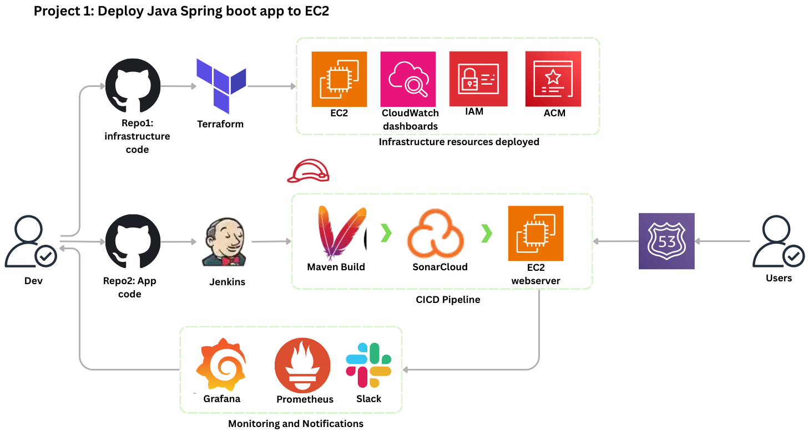

# 🚀 DevOps Project 1 – CI/CD Pipeline with Jenkins, Tomcat & EC2

## 📌 Project Overview

This project is part of a **hands-on DevOps learning series** designed to help **junior DevOps engineers** build real-world skills using industry-standard tools.

In this project, we build a **complete CI/CD pipeline** that:

- Provisions an EC2 instance using **UserData**
- Installs and configures:
  - **Java 17**
  - **Maven**
  - **Apache Tomcat 9**
  - **Jenkins**
- Builds a Java WAR application using **Maven**
- Deploys the application automatically to **Tomcat**
- Performs a basic **health check** 


## 🧠 Learning Objectives

By completing this project, you will learn how to:

- Use **EC2 UserData** for automated server bootstrapping
- Run **multiple services (Jenkins & Tomcat)** on the same VM without port conflicts
- Configure **Tomcat as a systemd service**
- Build and deploy Java applications using **Jenkins Pipelines**
- Understand **permissions, ownership, and service control** in Linux
- Troubleshoot **Java, Tomcat, and Spring runtime issues**

---

## 🏗️ Architecture




## 🔧 Technology Stack

| Component |Version |
|---------|--------|
| OS | Ubuntu 22.04 |
| Java | OpenJDK 17 |
| Maven | 3.x |
| Tomcat | 9.0.96 |
| Jenkins | LTS |
| Build Tool | Maven |
| Artifact Type | WAR |
| CI/CD | Jenkins Declarative Pipeline |

---

## 🌐 Service Ports

| Service | Port |
|-------|------|
| Tomcat (Application) | **8081** |
| Jenkins | **8080** |

> ⚠️ Ensure your EC2 Security Group allows inbound traffic on these ports.

## 🚀 EC2 Bootstrapping (UserData)

The EC2 instance is fully configured at launch using **UserData**.

### What UserData Does

- Installs Java 17 & Maven
- Installs Jenkins
- Installs and configures Tomcat
- Changes Tomcat port from `8080 → 8081`
- Creates a `tomcat` system user
- Registers Tomcat as a `systemd` service
- Starts Jenkins and Tomcat automatically

📄 **File:** `userdata.sh`

## 🔄 Jenkins Pipeline Overview

The pipeline is defined using a **Declarative Jenkinsfile**.

### Pipeline Stages

1. **Checkout**
   - Pulls code from the `main` branch

2. **Build Artifact**
   - Runs `mvn clean package`
   - Produces a WAR file

3. **Test**
   - Executes unit tests
   - Publishes test reports

4. **Deploy to Tomcat**
   - Stops Tomcat
   - Removes previous deployment
   - Copies WAR as `ROOT.war`
   - Sets permissions
   - Restarts Tomcat

5. **Health Check**
   - Verifies Tomcat is running
   - Performs HTTP check on the application
   - Scans logs for successful startup

📄 **File:** `Jenkinsfile`

## 📦 Deployment Strategy

The WAR file is deployed as:

/opt/apache-tomcat-9.0.96/webapps/ROOT.war

This makes the application available at:

http://<EC2-PUBLIC-IP>:8081/

## 🔐 Permissions Model

- Jenkins runs as user: `jenkins`
- Tomcat runs as user: `tomcat`
- Jenkins uses `sudo` to:
  - Control the Tomcat service
  - Copy WAR artifacts
  - Set file ownership

This mirrors **real-world CI/CD server setups**.


## 🧪 Health Check Logic

The pipeline verifies:

- Tomcat service status
- HTTP response from the application
- Spring initialization logs in `catalina.out`

---

## 🛠️ Common Troubleshooting

### View Tomcat logs
```bash
sudo tail -100 /opt/apache-tomcat-9.0.96/logs/catalina.out
Check Tomcat service
sudo systemctl status tomcat9
Jenkins logs
sudo journalctl -u jenkins -n 100
```

🔄 Improvements in Next Projects
Upcoming projects in this DevOps series will introduce:

- Nginx reverse proxy
- HTTPS with Let’s Encrypt
- Dockerized Jenkins & Tomcat
- GitHub Actions vs Jenkins
- AWS ALB + Auto Scaling
- Blue/Green deployments
- ECS & Kubernetes migration

🎯 Target Audience
This project is ideal for:
- Junior DevOps Engineers
- DevOps learners & students
- Engineers transitioning into DevOps
- Candidates preparing for DevOps interviews

✅ Final Result
After a successful pipeline run:

Jenkins Dashboard:

```
http://<EC2-PUBLIC-IP>:8082
```

Application:

```
http://<EC2-PUBLIC-IP>:8081
```